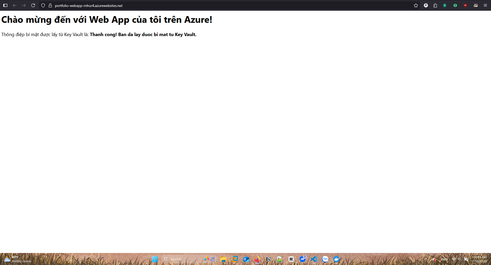
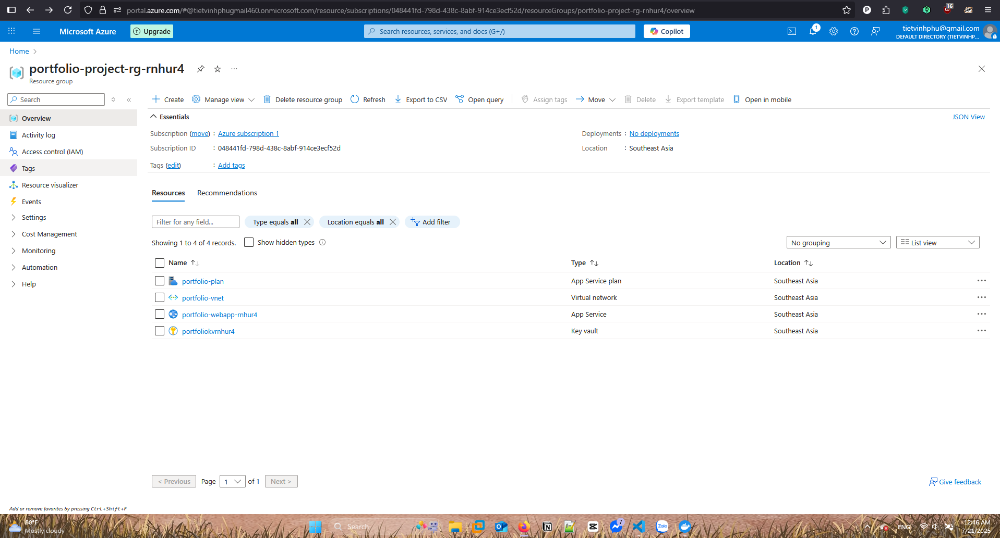

# Dự án: Ứng dụng Ghi chú An toàn trên Azure

## 1. Mô tả
Đây là một dự án full-stack hoàn chỉnh, trình bày cách triển khai một ứng dụng web Node.js được đóng gói bằng Docker lên Azure. Toàn bộ hạ tầng (Mạng, App Service, Key Vault) được quản lý bằng Terraform theo nguyên tắc Infrastructure as Code (IaC). Ứng dụng được bảo mật bằng cách sử dụng Managed Identity để truy xuất "secrets" từ Azure Key Vault mà không cần lưu trữ bất kỳ thông tin nhạy cảm nào trong code.

## 2. Sơ đồ kiến trúc
Ảnh sơ đồ kiến trúc dự án:


## 3. Công nghệ sử dụng
- **Cloud:** Microsoft Azure
- **IaC:** Terraform
- **Containerization:** Docker
- **Application:** Node.js, Express

## 4. Hướng dẫn triển khai
1.  Clone repository này.
2.  Đăng nhập Azure CLI (`az login`).
3.  Trong thư mục gốc của dự án, chạy các lệnh sau:
    ```bash
    terraform init
    terraform plan
    terraform apply
    ```
4.  Sau khi hạ tầng được tạo, cần phải xây dựng và đẩy Docker image của ứng dụng lên một container registry (như Azure Container Registry hoặc Docker Hub) và cập nhật cấu hình App Service để trỏ đến image đó.

## 5. Kiểm tra thành quả

Sau khi quá trình `terraform apply` hoàn tất và bạn đã triển khai ứng dụng, hãy làm theo các bước sau để xác nhận dự án đã thành công:

1.  **Lấy địa chỉ trang web:**
    * Sau khi `terraform apply` chạy xong, terminal sẽ hiển thị một output tên là `webapp_hostname`.
    * Hoặc bạn có thể vào VS Code, mở tab **Azure**, nhấp chuột phải vào App Service của bạn và chọn **Browse Website**.

2.  **Truy cập trang web:**
    * Mở trình duyệt và truy cập vào địa chỉ web đó.

3.  **Xác nhận nội dung:**
    * Nếu mọi thứ thành công, bạn sẽ thấy trang web hiển thị dòng chữ:
      > Chào mừng đến với Web App của tôi trên Azure!
      >
      > Thông điệp bí mật được lấy từ Key Vault là: **Thanh cong! Ban da lay duoc bi mat tu Key Vault.**

    * Việc nhìn thấy thông điệp bí mật này chứng tỏ ứng dụng không chỉ được triển khai thành công mà còn kết nối an toàn được với Azure Key Vault thông qua Managed Identity.

## 6. Thành quả cuối cùng (Final Result)

Dưới đây là hình ảnh chứng minh dự án đã triển khai và hoạt động thành công.

**1. Trang Web đang chạy trên Azure:**

Trang web đã truy cập được công khai và hiển thị thành công thông điệp bí mật được lấy từ Azure Key Vault, chứng tỏ kết nối an toàn qua Managed Identity đã hoạt động.



**2. Các tài nguyên được tạo bởi Terraform trên Azure Portal:**

Toàn bộ hạ tầng bao gồm App Service, Service Plan, Key Vault, Virtual Network... đều được tạo tự động bởi Terraform.



### ## Bài học rút ra
Qua dự án này, mình đã học được cách kết hợp nhiều công nghệ cốt lõi của DevOps và Cloud:
* **Infrastructure as Code (IaC):** Sử dụng Terraform để quản lý hạ tầng một cách tự động và nhất quán.
* **Containerization:** Đóng gói ứng dụng Node.js bằng Docker để đảm bảo tính di động.
* **Bảo mật:** Áp dụng các phương pháp bảo mật hiện đại như Key Vault và Managed Identity để loại bỏ hoàn toàn việc lưu trữ "secrets" trong code.
* **Mạng Đám mây:** Hiểu cách thiết lập các thành phần mạng cơ bản trên Azure.